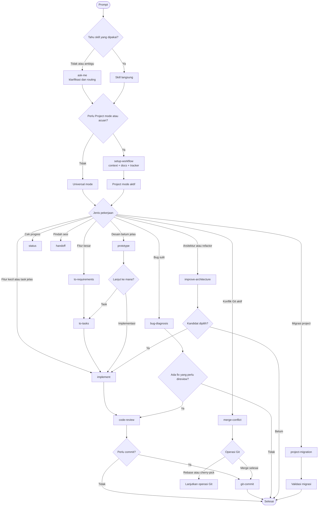

# Dev Workflow Skills

Kumpulan Agent Skills untuk membantu solo developer bekerja lebih terstruktur:
mulai dari requirement, task breakdown, implementasi, debugging, review,
commit, sampai handoff antar-sesi.

## Mulai dalam 3 langkah

### 1. Install

Windows:

```powershell
git clone https://github.com/Divarizky/dev-workflow-skills.git
cd dev-workflow-skills
.\install.ps1 --Pi
```

macOS/Linux:

```bash
git clone https://github.com/Divarizky/dev-workflow-skills.git
cd dev-workflow-skills
./install.sh --Pi
```

Git dan salah satu agent berikut diperlukan:

- [Pi](https://github.com/badlogic/pi-mono)
- Codex
- Claude Code

### 2. Buka project

Jalankan agent dari root project yang ingin dikerjakan.

### 3. Jelaskan pekerjaan

Tidak tahu harus memakai skill apa? Cukup tulis:

```text
Saya mau menambahkan sistem billing ke project ini. Bantu saya mulai.
```

`ask-me` akan membantu mengklarifikasi kebutuhan dan memilih alur.

Kalau sudah tahu skill yang dibutuhkan, sebutkan langsung:

```text
Gunakan to-requirements untuk merumuskan fitur billing ini.
```

## Flow keseluruhan



## Kapan memakai setiap skill?

| Skill | Gunakan untuk | Contoh prompt |
|---|---|---|
| `ask-me` | Klarifikasi dan routing | `Bantu saya menentukan langkah untuk fitur ini.` |
| `to-requirements` | Requirement dan acceptance criteria | `Buat requirements untuk fitur billing.` |
| `to-tasks` | Memecah requirement menjadi task | `Pecah requirements ini menjadi task.` |
| `implement` | Mengerjakan task | `Implementasikan task export CSV ini.` |
| `bug-diagnosis` | Bug yang sulit direproduksi | `Cari penyebab timeout ini dengan bug-diagnosis.` |
| `prototype` | Mengeksplorasi desain atau behavior | `Bandingkan dua desain API ini.` |
| `improve-architecture` | Analisis arsitektur dan refactor | `Cari peluang perbaikan arsitektur.` |
| `code-review` | Review perubahan | `Review perubahan staged ini.` |
| `git-commit` | Membuat commit | `Siapkan commit dari perubahan ini.` |
| `merge-conflict` | Konflik merge/rebase/cherry-pick | `Bantu resolve conflict yang aktif.` |
| `setup-workflow` | Gate Project mode, context, dan tracking project | `Siapkan workflow untuk project ini.` |
| `project-migration` | Migrasi project lama | `Migrasikan project lama ini.` |
| `status` | Snapshot pekerjaan | `Saya sedang mengerjakan apa?` |
| `handoff` | Melanjutkan di sesi lain | `Buat handoff untuk besok.` |

## Dua mode kerja

- **Universal mode**: default, tanpa `.workspace`, cocok untuk pekerjaan satu sesi.
  Hasil workflow ditampilkan di chat.
- **Project mode**: aktif jika `.workspace/project-meta.md` tersedia. Context,
  requirements, task, tracker, dan handoff disimpan di `.workspace/`.

`setup-workflow` adalah **gate umum** untuk project yang membutuhkan Project
mode, context, atau dokumentasi yang jelas. Setelah setup selesai, lanjutkan ke
skill sesuai kebutuhan project; tidak harus migrasi.

```text
Jalankan setup-workflow untuk project ini.
```

Salah satu cabangnya adalah migrasi:

```text
setup-workflow → project-migration
```

`project-migration` wajib menggunakan Project mode.

## Aturan penting

- Skill selain `ask-me` umumnya dipanggil langsung atau dijalankan sebagai chain.
- `code-review` dilakukan sebelum commit.
- Commit, resolusi conflict, migration cleanup, dan aksi berisiko memerlukan
  konfirmasi sesuai kondisinya.
- `bug-diagnosis` dapat berhenti sebagai diagnosis-only jika belum diminta
  memperbaiki bug.
- `prototype` menghasilkan keputusan desain; tidak mengubah production code
  kecuali prototype executable diminta secara eksplisit.

## Advanced installation and maintenance

Gunakan bagian ini hanya jika diperlukan.

| Flag | Fungsi |
|---|---|
| `--Pi` | Pasang untuk Pi |
| `--Codex` | Pasang untuk Codex |
| `--Claude` | Pasang untuk Claude Code |
| `--backup-existing` | Backup target lama sebelum membuat link |
| `--unlink` | Melepas link yang dibuat installer |
| `--repo-url URL` | Menggunakan repository source lain |

Contoh memasang ke beberapa agent:

```powershell
.\install.ps1 --Pi --Codex --Claude
```

```bash
./install.sh --Pi --Codex --Claude
```

Untuk update, jalankan installer lagi. Jika clone default melalui SSH gagal,
gunakan `--repo-url` dengan URL HTTPS:

```powershell
.\install.ps1 --Pi --repo-url "https://github.com/Divarizky/dev-workflow-skills.git"
```

`--unlink` hanya melepas link; source skill tidak dihapus.

## Instalasi package Pi

```bash
pi install git:git@github.com:Divarizky/dev-workflow-skills
```

Untuk Codex dan Claude Code, gunakan installer di atas.

## Dokumentasi lengkap

- [Workflow utama](skills/dev/WORKFLOW.md)
- [Aturan umum](skills/dev/shared/COMMON.md)
- [Prompt design dan safety](skills/dev/shared/PROMPT-DESIGN.md)

## Kontribusi

Baca dokumentasi lengkap sebelum mengubah skill. Sertakan contoh penggunaan dan
cara validasi pada setiap perubahan.
